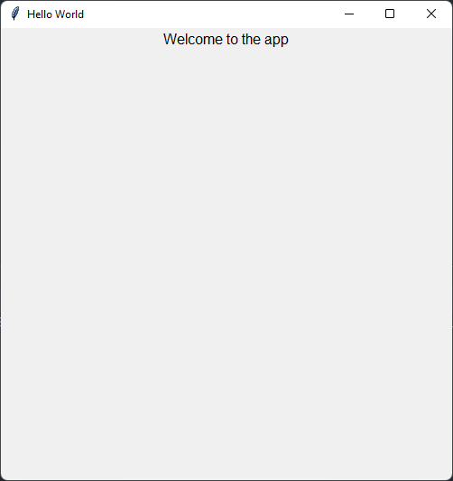

# Python GUI Hello World

## Description:

This project is a simple guide to getting started on creating a GUI application on Python. This project makes use of the [guizero python library](https://lawsie.github.io/guizero/about/).

## How to Run:

1. Fork the Repository
2. Clone the Repository
3. Run the Code in your IDE

## Source Code:

```python
# import widgets from quizero library
from guizero import App, Text

# create a container widget
app = App(title="Hello World")

# add a text widget
message = Text(app, text="Welcome to the app")

# display the gui app
app.display()
```

## GUI Result:

